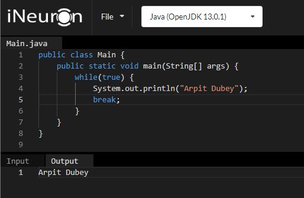
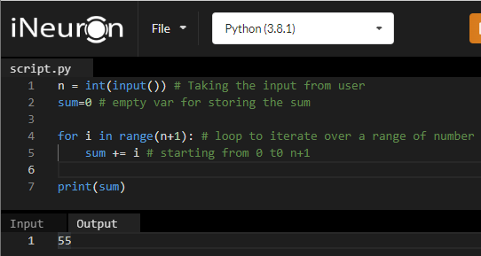

# Introduction to Algorithms and Apriori Analysis Discussion 


## Algorithms

- Algorithm are the step by step (or) "sequence of finite steps", procedure, instructions, processes "to perform some specific task".

- Suppose for example let's take example of multiplication of two numbers "a" & "b":
```
1. Take two numbers --> a & b.
2. Take c = a * b
3. Return c.  
```

- Algorithm has "certain properties/features" to differentiate it from normal code. Every code is not an Algorithm.


### Properties :
<hr>

1. Terminate after finite amount of time.
2. Produce atleast one output.
3. Independent of any programming.
4. Code should be Unambiguous : output of Algorithm should be Deterministic.

```
In first try:
2 * 3 = 6  ----- (1)

In second try:
2 * 3 = 10 ----- (2)

(1) & (2) are ambiguous & non- Deterministic

----------------------

In first try:
2 * 3 = 6  ----- (3)

In second try:
2 * 3 = 6  ----- (4)

(3) & (4) are unambiguous &Deterministic code.

```

Check this is an algorithm or not:
```
while(True):
    print("Arpit Dubey")
```

Here, it is not an Algorithm.

 1. Terminate after finite amount of time.

```
while(True):
    print("Arpit Dubey")
```

while(True) --> while condition is True and there is no base condition to stop the continous loop therefore, it will run  for infinite amount of time.

2. Produce atleast one output.

```
print("Arpit Dubey")
```

It will produce one print statement as an output, and print Arpit Dubey in console


Here I used ``` break; ``` statement to terminate the infinite iteration.

3. Independent of any programming.

So, the code can be written in various language with different compatible syntax to that language.

> ## Code in java:

> ## Code in java Script


4. Code should be Unambiguous : output of Algorithm should be Deterministic.

- Yes, code is unambiguous and Deterministic because a print function can print whatever we give input to print means same input gives same output in any system.

## Steps to construct an Algorithm :
<hr>

1. Clearity of ```Problem Definition```.

2. ```Design the Algorithm```
    - Divide & Conquer.
    - Greedy Algorithm
    - Dynamic Programming
    & many more, etc,.
    
<br>

3. Draw ```Flow chart```

4. ```Testing```


5. ```Implementation ```
- Making logics and approaches to resolve and find the output.

6. ```Analysis```


- Different students S1, S2, and S3 try to solve one problem P1 with their own logics. All got the required output

- S1 solve P1 in 100 ms, S2 solves P1 in 50 ms and S3 solves P1 in 20 ms.

- S3 comes up with better logic to solve P1.

Analysis are done on ground of Time and Space.

Time complexity must low, as compare to space complexity,

Ques :  Find the sum of n natural numbers.

Test cases: 
```
input:
n = 10
{1, 2, 3, 4, 5, 6, 7, 8, 9, 10}

Output:
55
```

S1: Dharun solution:


S2: Arvind solution:


Hence Arvind solution is short and time taken is less because it doesn't undergo to any loop.